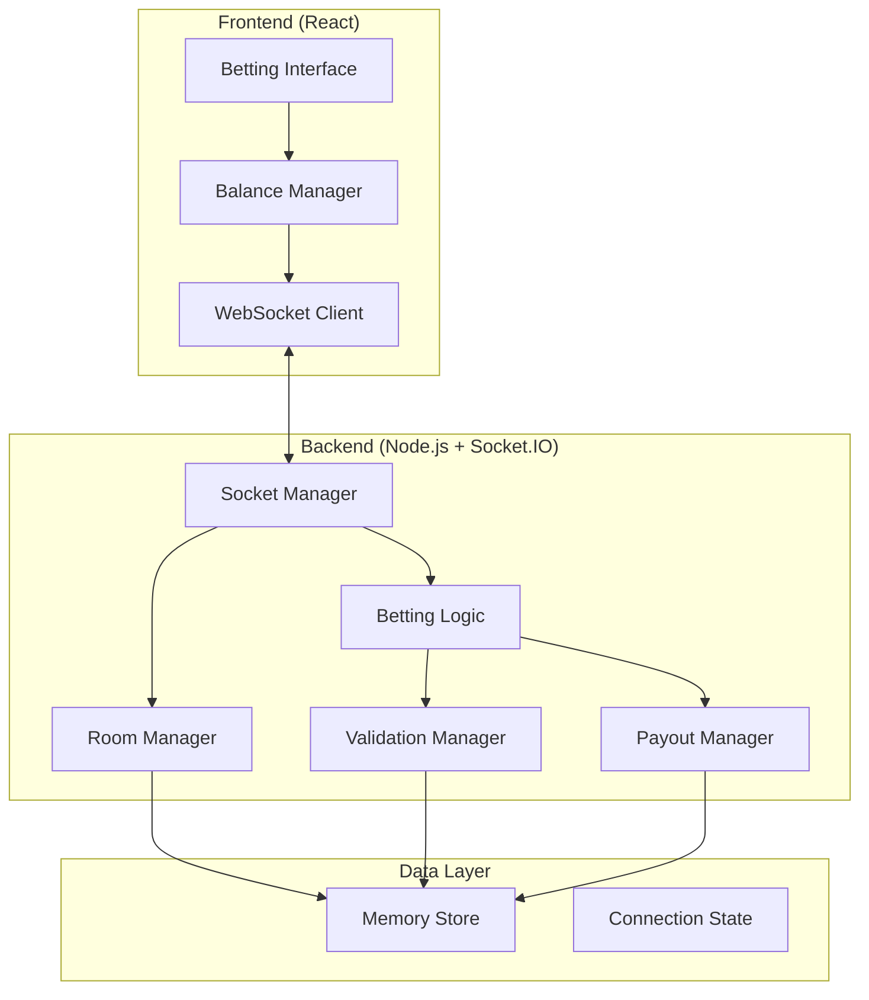
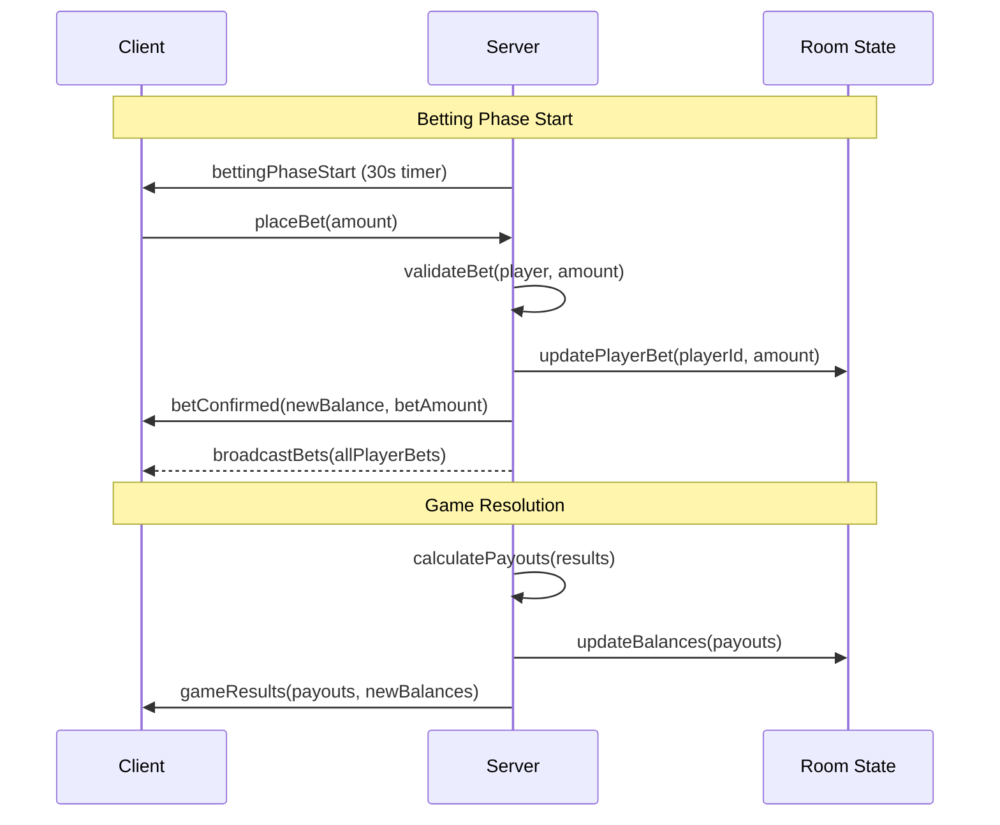

# Design Document

## Overview

El sistema de betting mejorado implementará un flujo completo de apuestas para el juego de Blackjack multiplayer. El diseño se basa en una arquitectura cliente-servidor con comunicación en tiempo real vía WebSockets, gestión de estado centralizada en el servidor, y una interfaz de usuario reactiva en el frontend.

### Key Design Principles

- **Server Authority**: El servidor es la única fuente de verdad para balances y apuestas
- **Atomic Operations**: Todas las transacciones de balance son atómicas para evitar inconsistencias
- **Real-time Sync**: Sincronización inmediata de estados entre todos los clientes
- **Graceful Degradation**: El sistema continúa funcionando incluso con errores parciales
- **Performance First**: Optimizado para baja latencia y alta concurrencia

## Architecture

### High-Level Architecture



### Data Flow Architecture



## Components and Interfaces

### Backend Components

#### 1. Enhanced MultiplayerPlayer Type

```typescript
type MultiplayerPlayer = {
  // Existing fields
  id: string;
  name: string;
  position: number;
  hand: Card[];
  total: number;
  isBust: boolean;
  isStand: boolean;
  isBlackjack: boolean;
  status: 'playing' | 'stand' | 'bust' | 'blackjack';
  victories: number;
  gamesWon: number;
  gamesBlackjack: number;
  gamesLost: number;
  gamesDraw: number;
  gamesBust: number;
  
  // New betting fields
  balance: number;
  currentBet: number;
  hasPlacedBet: boolean;
  betHistory: BetRecord[];
  totalWinnings: number;
  totalLosses: number;
};

type BetRecord = {
  roundId: string;
  amount: number;
  result: 'win' | 'lose' | 'draw' | 'bust' | 'blackjack';
  payout: number;
  timestamp: number;
};
```

#### 2. Enhanced GameState Type

```typescript
type MultiplayerGameState = {
  started: boolean;
  players: MultiplayerPlayer[];
  dealer: MultiplayerDealer;
  deck: Card[];
  turn: number;
  phase: 'betting' | 'dealing' | 'playing' | 'dealer' | 'result';
  results?: { [playerId: string]: GameResult };
  
  // New betting fields
  bettingTimeLeft: number;
  minBet: number;
  maxBet: number;
  roundId: string;
  totalPot: number;
};

type GameResult = {
  status: 'win' | 'lose' | 'draw' | 'bust' | 'blackjack';
  payout: number;
  finalBalance: number;
};
```

#### 3. Betting Manager Class

```typescript
class BettingManager {
  private rooms: Map<string, Room>;
  
  // Core betting operations
  validateBet(player: MultiplayerPlayer, amount: number): BetValidationResult;
  placeBet(roomCode: string, playerId: string, amount: number): Promise<BetResult>;
  calculatePayout(bet: number, result: GameResultStatus): number;
  processPayouts(roomCode: string, results: GameResults): Promise<PayoutResults>;
  
  // Balance management
  updateBalance(playerId: string, amount: number, operation: 'add' | 'subtract'): boolean;
  getPlayerBalance(playerId: string): number;
  resetPlayerBets(roomCode: string): void;
  
  // Betting phase management
  startBettingPhase(roomCode: string): void;
  endBettingPhase(roomCode: string): void;
  handleBettingTimeout(roomCode: string): void;
}
```

#### 4. Socket Event Handlers

```typescript
// New betting-related socket events
socket.on('placeBet', ({ code, amount }) => {
  // Validate and place bet
});

socket.on('updateBet', ({ code, amount }) => {
  // Update existing bet
});

socket.on('allIn', ({ code }) => {
  // Place all-in bet
});

socket.on('clearBet', ({ code }) => {
  // Clear current bet
});

// Enhanced existing events
socket.on('startGameInRoom', (code) => {
  // Start with betting phase instead of dealing
});
```

### Frontend Components

#### 1. Enhanced BettingPanel Component

```jsx
const BettingPanel = ({
  balance,
  currentBet,
  bettingTimeLeft,
  minBet,
  maxBet,
  onPlaceBet,
  onUpdateBet,
  onAllIn,
  onClearBet,
  disabled,
  isConnected
}) => {
  // Chip selection logic
  // Bet validation
  // Timer display
  // Balance display
  // Error handling
};
```

#### 2. New BettingPhaseManager Component

```jsx
const BettingPhaseManager = ({
  gameState,
  socket,
  roomCode,
  playerId
}) => {
  // Manages betting phase lifecycle
  // Handles betting timer
  // Coordinates with BettingPanel
  // Manages bet synchronization
};
```

#### 3. Enhanced PlayerPosition Component

```jsx
const PlayerPosition = ({ player, isCurrentPlayer, gamePhase }) => {
  return (
    <div className="player-position">
      {/* Existing player info */}
      
      {/* New betting info */}
      <div className="player-betting-info">
        <div className="player-balance">Balance: {player.balance}</div>
        <div className="player-bet">Bet: {player.currentBet}</div>
        {gamePhase === 'betting' && (
          <div className="betting-status">
            {player.hasPlacedBet ? '✓ Bet Placed' : 'Placing bet...'}
          </div>
        )}
      </div>
    </div>
  );
};
```

## Data Models

### Balance Transaction Model

```typescript
interface BalanceTransaction {
  id: string;
  playerId: string;
  roomCode: string;
  type: 'bet' | 'payout' | 'refund' | 'initial';
  amount: number;
  balanceBefore: number;
  balanceAfter: number;
  timestamp: number;
  roundId: string;
  metadata?: {
    betAmount?: number;
    gameResult?: string;
    payoutMultiplier?: number;
  };
}
```

### Betting Session Model

```typescript
interface BettingSession {
  roomCode: string;
  roundId: string;
  startTime: number;
  endTime?: number;
  duration: number;
  bets: Map<string, PlayerBet>;
  status: 'active' | 'completed' | 'cancelled';
  totalPot: number;
}

interface PlayerBet {
  playerId: string;
  amount: number;
  placedAt: number;
  isAllIn: boolean;
  balanceAfterBet: number;
}
```

### Payout Calculation Model

```typescript
interface PayoutCalculation {
  playerId: string;
  betAmount: number;
  gameResult: 'win' | 'lose' | 'draw' | 'bust' | 'blackjack';
  payoutMultiplier: number;
  payoutAmount: number;
  finalBalance: number;
  isValid: boolean;
  errors?: string[];
}
```

## Error Handling

### Error Types and Recovery Strategies

#### 1. Betting Validation Errors

```typescript
enum BettingErrorType {
  INSUFFICIENT_BALANCE = 'insufficient_balance',
  INVALID_AMOUNT = 'invalid_amount',
  BETTING_CLOSED = 'betting_closed',
  DUPLICATE_BET = 'duplicate_bet',
  PLAYER_NOT_FOUND = 'player_not_found',
  ROOM_NOT_FOUND = 'room_not_found'
}

interface BettingError {
  type: BettingErrorType;
  message: string;
  playerId: string;
  roomCode: string;
  timestamp: number;
  recoverable: boolean;
  suggestedAction?: string;
}
```

#### 2. Balance Inconsistency Recovery

```typescript
class BalanceRecoveryManager {
  detectInconsistency(player: MultiplayerPlayer): boolean;
  recalculateBalance(player: MultiplayerPlayer): number;
  restoreFromLastKnownGood(playerId: string): boolean;
  auditBalanceHistory(playerId: string): BalanceAuditResult;
}
```

#### 3. Network Error Handling

- **Connection Loss**: Queue betting operations and replay on reconnection
- **Timeout Handling**: Auto-place minimum bet if player doesn't respond
- **Partial Updates**: Use checksums to verify data integrity
- **Race Conditions**: Implement optimistic locking for balance updates

## Testing Strategy

### Unit Tests

1. **Betting Validation Tests**
   - Valid bet amounts
   - Invalid bet amounts (negative, zero, exceeds balance)
   - Edge cases (exact balance, minimum/maximum bets)

2. **Payout Calculation Tests**
   - Standard win (2:1)
   - Blackjack win (2.5:1)
   - Draw/push (1:1)
   - Loss/bust (0:1)
   - Rounding edge cases

3. **Balance Management Tests**
   - Balance updates
   - Transaction atomicity
   - Concurrent access
   - Recovery scenarios

### Integration Tests

1. **Betting Flow Tests**
   - Complete betting phase lifecycle
   - Multiple players betting simultaneously
   - Timeout scenarios
   - Error recovery

2. **Real-time Synchronization Tests**
   - State broadcasting
   - Client synchronization
   - Connection stability
   - Reconnection handling

### End-to-End Tests

1. **Complete Game Flow**
   - Join room → Bet → Play → Receive payout
   - Multiple rounds with balance persistence
   - Player disconnection/reconnection
   - Error scenarios

2. **Performance Tests**
   - Multiple concurrent rooms
   - High-frequency betting operations
   - Memory usage optimization
   - Network bandwidth optimization

### Test Data Scenarios

```typescript
const testScenarios = [
  {
    name: 'Standard Betting Flow',
    players: 4,
    initialBalance: 1000,
    bets: [100, 250, 500, 50],
    expectedResults: ['win', 'lose', 'blackjack', 'draw']
  },
  {
    name: 'All-In Scenario',
    players: 2,
    initialBalance: 500,
    bets: [500, 500],
    expectedResults: ['win', 'lose']
  },
  {
    name: 'Low Balance Recovery',
    players: 3,
    initialBalance: 25,
    bets: [25, 25, 25],
    expectedResults: ['lose', 'win', 'draw']
  }
];
```

## Performance Considerations

### Optimization Strategies

1. **Memory Management**
   - Use object pooling for frequently created objects
   - Implement efficient data structures for balance tracking
   - Regular garbage collection of completed betting sessions

2. **Network Optimization**
   - Batch balance updates when possible
   - Use delta updates instead of full state broadcasts
   - Implement compression for large state updates

3. **Concurrency Handling**
   - Use atomic operations for balance updates
   - Implement proper locking mechanisms
   - Queue betting operations to prevent race conditions

4. **Caching Strategy**
   - Cache frequently accessed player data
   - Pre-calculate common payout scenarios
   - Use memoization for validation functions

### Scalability Considerations

- **Horizontal Scaling**: Design for multiple server instances
- **Load Balancing**: Distribute rooms across servers
- **Database Integration**: Prepare for persistent storage migration
- **Monitoring**: Implement comprehensive logging and metrics

This design provides a robust foundation for implementing the enhanced betting system while maintaining the existing game functionality and ensuring scalability for future enhancements.